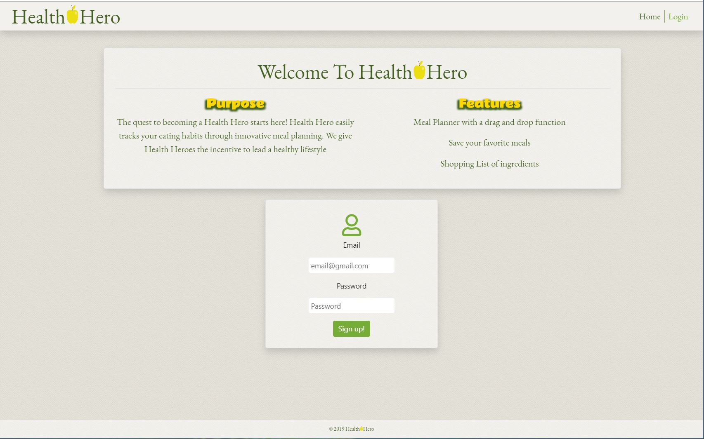

# Health Hero
A meal planner with the ability to drag and drop for each day of the week in breakfast, lunch, or dinner.

## Images

## Site Link
https://mgilliland23.github.io/Project-1/index.html

## Built With

* [Edamam Recipe Search API](https://developer.edamam.com/edamam-recipe-api) - API for recipe info and search
* [Google Firebase](https://firebase.google.com/) - For user authentication and database
* [Font Awesome](https://fontawesome.com/v4.7.0/icons/) - Used for icons
* [Dragula](https://github.com/bevacqua/dragula) - For drag and drop function
* [Bootstrap](https://getbootstrap.com/) - CSS library
* [Animate.css](https://daneden.github.io/animate.css/) - For animations
* [jQuery](https://jquery.com/) - Javascript Library
* HTML5, CSS3, and JavaScript

## Authors
* Matt Gilliland
* Daniel LaZenberry
* Kayleigh Starr
* Luis Espino

